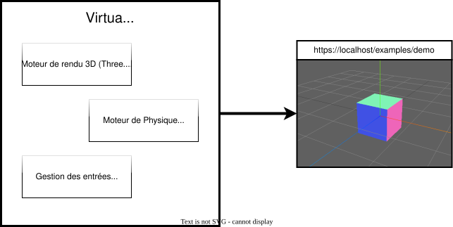

# Prise en main de VirtualDev

## Qu'est-ce que VirtualDev ?

**VirtualDev** est un framework Javascript pour le développement d'applications 3D immersives s'exécutant dans des navigateurs modernes.

## Prérequis

L'utilisation de VirtualDev implique une connaissance de base de **JavaScript** et de HTML/CSS, qui sont les langages utilisés par VirtualDev.

De plus, l'utilisation d'un éditeur de code est recommandée pour écrire le code source de votre projet (par exemple [Visual Studio Code](https://code.visualstudio.com/)).

