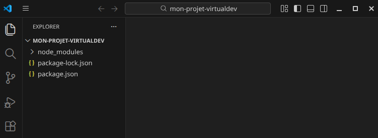
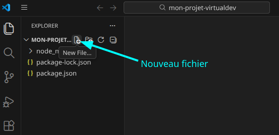
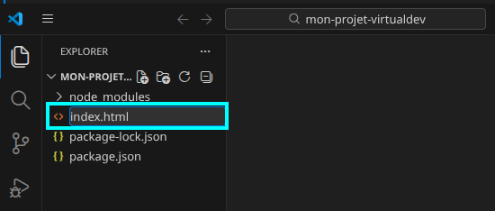
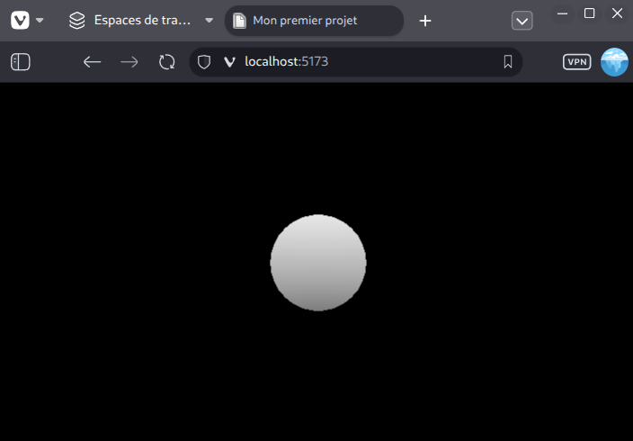

# Créer une application simple avec VirtualDev

## Créer une nouvelle application à partir de zéro

1. Ouvrir le projet `mon-projet-virtualdev` avec Visual Studio Code.

```bash
cd mon-projet-virtualdev
code .
```


2. Créer un nouveau fichier qu'on nommera `index.html`.





Ce fichier est le point d'entrée de votre application Web exécutée par le navigateur.

Plaçer dans ce fichier le code miminal pour afficher une sphère blanche dans une page Web.

<<< @/apps/simple-app/index.html

3. Exécuter l'application Web dans un navigateur.

Ouvrir une console dans VSCode (Menu `Terminal` > `Nouvelle Console` ou le raccourci `CTRL+J`). Taper la commande suivante :

```bash
npx vite
```
Un serveur de développement Web est lancé pour servir l'application Web sur l'URL http://localhost:5173/. Ouvrir ce lien dans un navigateur Web.

Le navigateur doit afficher une sphère blanche sur fond noir dans une page Web.



## Organiser son application Web

Dans l'exemple précédent, le fichier `index.html` contient le code JavaScript qui permet de construire l'application Web. Ce code JavaScript est placé entre deux balises HTML `<script>` et `</script>`.

Cela fonctionne mais on préfèrera mettre le code JavaScript dans un fichier JavaScript distinct pour faciliter la maintenance de l'application.

1. Créer un sous-dossier `src` dans le dossier `mon-projet-virtualdev`.

2. Créer un fichier qu'on nommera `main.js` dans le sous-dossier `src`.

3. Placer le code JavaScript suivant dans le fichier `main.js` :

<<< @/apps/simple-app-2/src/main.js

4. Modifier le fichier `index.html` pour importer le fichier `main.js` :

<<< @/apps/simple-app-2/index.html